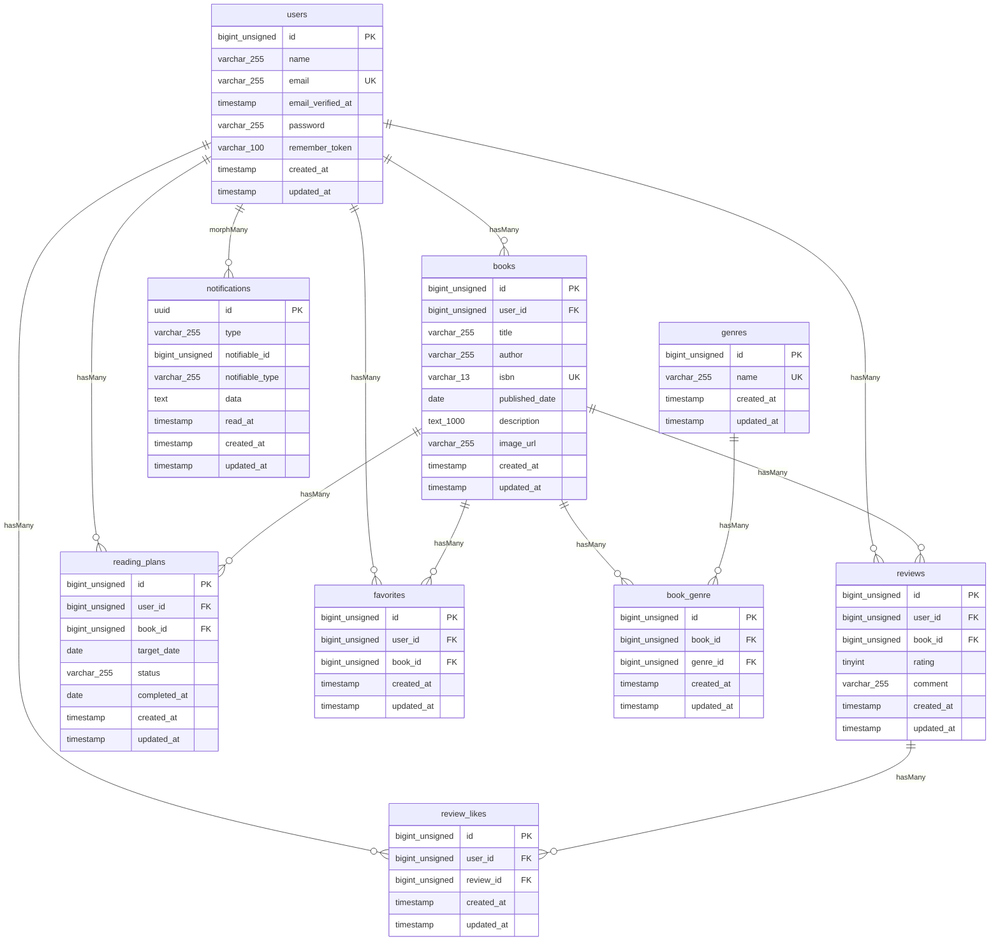

# BookShelf 書籍レビューアプリ
## 概要
本システムは、書籍レビュー機能を実装したLaravelプロジェクトです。
ユーザーは書籍を登録・閲覧し、レビューの投稿やお気に入り登録ができます。
書籍の登録にはGoogle Books API連携を取り入れ、ISBN-13による書籍情報の自動取得に対応しています。
書籍の検索機能や、ジャンルによる分類・絞り込み、レビューへのいいね機能、平均評価に基づくランキング機能も備えています。
統計ダッシュボードとして、レビュー数、ジャンルごとの評価傾向を表示できるマイ読書レポートを表示することができます。
また、リマインダー通知を備えた読書計画機能を実装しています。
外部アプリケーション向けの公開API（JSON）を提供しています。

## 作成者
浅井 明日香

## 使用技術
### バックエンド
- PHP 8.5
- Laravel 10.4
- Laravel Fortify（認証機能）
- Laravel Sanctum（APIトークン認証）
- MySQL 8.4

### フロントエンド
- Tailwind CSS 3.4
- Vite

### 開発ツール
- Docker / Docker Compose / Laravel Sail
- phpMyAdmin
- Nginx
- PHPUnit（テスト）
- Postman（API動作確認）
- Git/GitHub（バージョン管理）

## ER図


## 開発環境URL
http://localhost

## 動作環境
- Docker
- Docker Compose

※ Windowsの場合はWSL2の利用を推奨します。

## 環境構築手順

1. リポジトリを取得  
任意のディレクトリでリポジトリをクローンします。
```
git clone https://github.com/Asuka-Asai06/contact-form-app.git contact-form-app
```

2. プロジェクトディレクトリに移動
```
cd contact-form-app
```

3. Composer依存パッケージをインストール
```
docker run --rm \
    -u "$(id -u):$(id -g)" \
    -v "$(pwd):/var/www/html" \
    -w /var/www/html \
    laravelsail/php82-composer:latest \
    composer install --ignore-platform-reqs
```

4. 環境設定ファイルをコピー  
.env.example をコピーして .env を作成します。
```
cp .env.example .env
```
.env ファイル内の以下のDB接続情報を確認・設定します。.env.example のデフォルト値はSail向けではないため、以下のように変更してください。
```
DB_CONNECTION=mysql
DB_HOST=mysql
DB_PORT=3306
DB_DATABASE=laravel
DB_USERNAME=sail
DB_PASSWORD=password
```

5. Laravel Sailを起動  
以下のコマンドでDockerコンテナを起動します。
```
./vendor/bin/sail up -d
```
エイリアスの設定（推奨）  
毎回 ./vendor/bin/sail と入力するのは手間なので、エイリアスを設定すると便利です。
```
alias sail='[ -f sail ] && bash sail || bash vendor/bin/sail'
```

6. アプリケーションキーの生成
```
./vendor/bin/sail artisan key:generate
```

7. データベースのマイグレーションと初期データ投入  
以下のコマンドでテーブルを作成し、ダミーデータを投入します。  
```
sail artisan migrate:fresh --seed
```

このコマンドの入力後、下記のエラーが表示されることがあります。
```
   Illuminate\Database\QueryException 
  SQLSTATE[HY000] [1044] Access denied for user 'sail'@'%' to database 'contact-form-app' (Connection: mysql, SQL: select table_name as `name`,         (data_length + index_length) as `size`, table_comment as `comment`, engine as `engine`, table_collation as `collation` from information_schema.tables where table_schema = 'contact-form-app' and table_type in ('BASE TABLE', 'SYSTEM VERSIONED') order by table_name)

  at vendor/laravel/framework/src/Illuminate/Database/Connection.php:829
    825▕                     $this->getName(), $query, $this->prepareBindings($bindings), $e
    826▕                 );
    827▕             }
    828▕ 
  ➜ 829▕             throw new QueryException(
    830▕                 $this->getName(), $query, $this->prepareBindings($bindings), $e
    831▕             );
    832▕         }
    833▕     }

  +43 vendor frames 

  44  artisan:35
      Illuminate\Foundation\Console\Kernel::handle()
```
このエラーはコンテナ内にデータが残っており、エラーが生じているケースなどがあります。 その場合は、以下のコマンドを順に実行して各コンテナを再起動して下さい。
```
sail down -v
sail up -d //コマンド実行後にSQLコンテナが立ち上がるまで時間がかかります。30秒ほどお待ちください。
sail artisan migrate:fresh --seed
```

8. 通知機能の動作確認
本アプリでは、読書計画の期限チェックを毎日0:00に実行するようスケジュールされています。
ローカル環境で通知機能を確認するには、以下のコマンドを実行してください。
```
sail artisan reading-plans:check
```
実行後、期限切れまたは期限が近い読書計画があるユーザーに通知が作成されます。

9. NPM依存パッケージのインストール
```
sail npm install
sail npm install alpinejs
sail npm run dev
```
npm run dev は開発中は起動したままにしてください。

10. アプリケーションへのアクセス
ブラウザで http://localhost にアクセスします。

## Google Books API
書籍登録時にGoogle Books APIと連携し、ISBNから書籍情報を取得できます。

### Setup
Google Books APIを利用するため、Google Cloud ConsoleでAPIキーを発行してください。  
`.env` に以下を追加します。
```env
GOOGLE_BOOKS_API_KEY=your_api_key
```

### 使用方法
書籍登録画面でISBNを入力して検索すると、以下の情報を自動取得します。

- タイトル
- 著者
- 出版日
- 書影画像

※ Google Books APIの利用制限により、一時的にリクエスト制限（429 Too Many Requests）が発生する場合があります。


## テスト実行
```
sail artisan test
```
カバレッジ付きで実行する場合:
```
sail artisan test --coverage
```

## 機能一覧
- ユーザー認証（登録、ログイン、ログアウト）
- 書籍登録・Google Books APIによる書籍情報の自動取得・一覧表示・キーワード検索・ジャンル絞り込み・ソート機能（新しい/古い/タイトル/評価）
- 書籍詳細表示・編集・削除・書籍へのお気に入り登録
- 書籍へのレビュー投稿・編集・削除・レビューへのいいね
- レビューの平均評価を集計した書籍ランキング機能
- ユーザーの総レビュー数・読了冊数・平均評価・評価分布・高評価書籍TOP5・ジャンル別評価傾向TOP5を表示するマイ読書レポート機能
- 書籍と期日を登録できる読書計画機能
- 期日3日前・期日当日・期限3日超過を通知するリマインダー機能

## APIエンドポイント一覧
全エンドポイントは /api/v1 プレフィックス配下に定義されています。  
書き込み系エンドポイント（POST/PUT/DELETE）には Laravel Sanctum によるトークン認証を導入しています。読み取り系エンドポイント（GET）は認証不要の公開APIです。
| Method | Endpoint             | Description | Authentication |
| ------ | -------------------- | ----------- | -------------- |
| GET    | `/api/v1/books`      | 書籍一覧取得      | 不要             |
| GET    | `/api/v1/books/{id}` | 書籍詳細取得      | 不要             |
| POST   | `/api/v1/books`      | 書籍登録        | **Sanctum**    |
| PUT    | `/api/v1/books/{id}` | 書籍更新        | **Sanctum**    |
| DELETE | `/api/v1/books/{id}` | 書籍削除        | **Sanctum**    |

**Authentication**
- GET エンドポイントは認証不要で利用できます。
- POST、PUT、DELETE エンドポイントは Laravel Sanctum による認証が必要です。
- 認証時は、APIトークンを Authorization ヘッダーに指定してください。
```
Authorization: Bearer {token}
```

### 検索・絞り込み
書籍一覧取得APIは、キーワード検索とジャンルによる絞り込みに対応しています。  

**Endpoint**
```
GET /api/v1/books
```
| Parameter | Type | Description |
| --- | --- | --- |
| keyword | string | 書籍名・著者名による部分一致検索 |
| genre | string | ジャンル名による絞り込み |

**例**
```
GET /api/v1/books?keyword=Laravel&genre=PHP
```

## 要件シート外実装事項
- 同一書籍へのレビューは1ユーザー1件まで
- 自分のレビューにいいねはできないように設計
- レビューの改行表示（Tailwind CSSのwhitespace-pre-line）
- レビュー右下、編集・削除ボタンのインデントずれを修正
